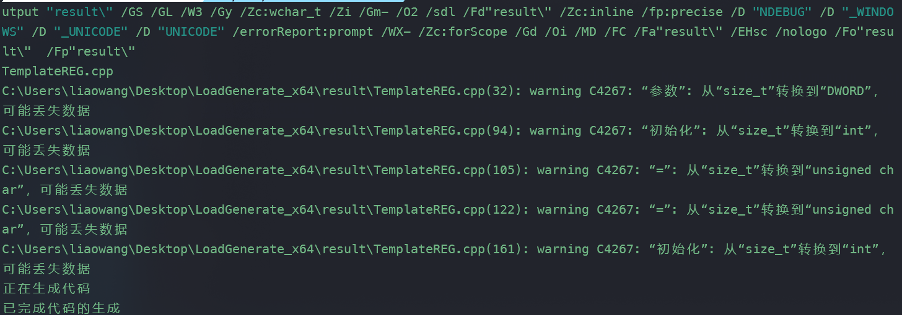

# LoadGenerate一个开源的现代一个简单的免杀加载生成器

[在这里下载](https://github.com/l140w4n9/LoadGenerate/files/9088861/LoadGenerate_x64.zip)，推荐使用64位，64位免杀效果比较好


### 概述

​	小刚师傅写了一个[python的免杀框架](https://mp.weixin.qq.com/s/0ni8iNZyMgHle2LdgtQ8Lg)，再一次攻防中上传小刚师傅框架生成的免杀时，发现木马太大无法上传，因此根据小刚师傅的python版免杀框架改编了一个C++版的免杀框架[LoadGenerate](https://github.com/l140w4n9/LoadGenerate)

### 发布

v1.0.0——初始版本

### 安装使用

CS生成bin文件


生成shellcode加载器


编译shellcode加载器

​	1、使用VS可以直接编译


 2、不想安装VS的可以使用从VS中分离出的compile工具编译

​	配置INCLUDE环境变量——>新建INCLUDE——>把include下的五个文件夹的绝对路径写入


​	配置LIB环境变量——>新建LIB——>把lib文件夹的绝对路径写入


```
.\compile\x64\cl.exe .\result\TemplateREG.cpp /permissive- /ifcOutput "result\" /GS /GL /W3 /Gy /Zc:wchar_t /Zi /Gm- /O2 /sdl /Fd"result\" /Zc:inline /fp:precise /D "NDEBUG" /D "_WINDOWS" /D "_UNICODE" /D "UNICODE" /errorReport:prompt /WX- /Zc:forScope /Gd /Oi /MD /FC /Fa"result\" /EHsc /nologo /Fo"result\"  /Fp"result\"
```



### 免杀测试

